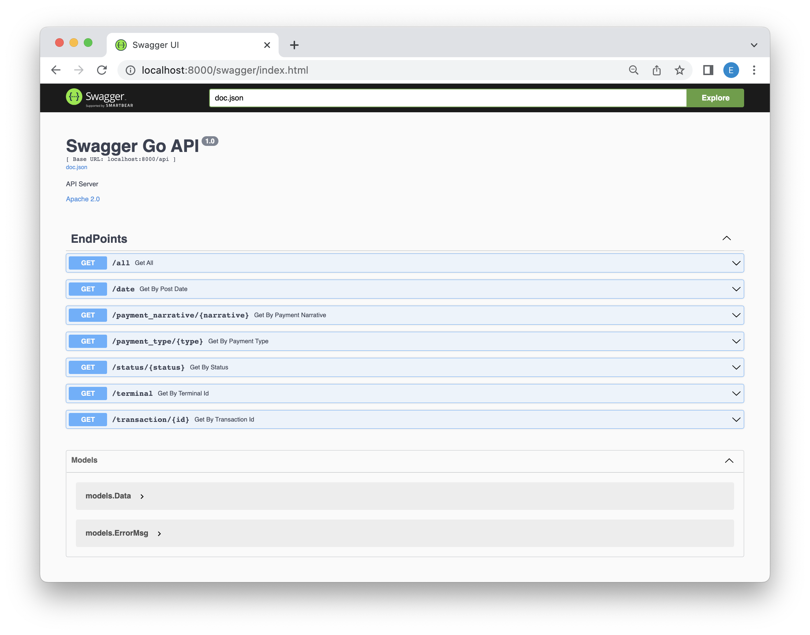

# Golang REST API

Go RESTful API with PostgreSQL and Docker.

## Preparing to launch a project

- Install [Golang](https://golang.org/doc/install)
- Install [Docker](https://docs.docker.com/get-docker/)
- Install [Migrate](https://github.com/golang-migrate/migrate/blob/master/cmd/migrate/README.md)
- Install Postgres

```bash
docker pull postgres:15-alpine
```

## Install & Run

```bash
# download this project
git clone https://github.com/esmira23/go-postgresql-docker.git
```

Before running API server, you should build docker image and run it. Also you need to create database and use db/migration to create table.

```bash
cd go-postgresql-docker
# build and run docker-compose
make build && make run
# create db and migrate table
make createdb && make migrateup
```

Now you can build and run project.

```bash
# build and run
go build
./go-postgresql-docker

# API Endpoint : http://127.0.0.1:8000
```

## Project tree

```
├── db/migration                        // migration for database
│   ├── 000001_init_schema.down.sql
│   └── 000001_init_schema.up.sql
├── docs                                // swagger
│   ├── docs.go
│   ├── swagger.json
│   └── swagger.yaml
├── config
│   └── config.go                       // configuration for database
├── controllers
│   └── controller.go                   // controllers for application
├── csvparser
│   ├── csvparser.go                    // csv parser
│   └── example.csv                     // csv data
├── routers
│   └── router.go                       // routers for application
├── models
│   └── model.go                        // models for application
├── Makefile
├── docker-compose.yml                  // docker compose file
├── main_test.go                        // unit tests
└── main.go
```

## API

| Method | Path                                | Description                                 |
| ------ | ----------------------------------- | ------------------------------------------- |
| `GET`  | /api/all                            | Get all data                                |
| `GET`  | /api/transaction/:id                | Get data by transaction id                  |
| `GET`  | /api/terminal?id=id_1,id_2,..,id_n  | Get data by terminal id (allow several ids) |
| `GET`  | /api/status/:status                 | Get data by status (accepted/declined)      |
| `GET`  | /api/payment_type/:type             | Get data by payment type (cash/card)        |
| `GET`  | /api/date?from=date_from&to=date_to | Get data by date_post by periods (from/to)  |
| `GET`  | /api/payment_narrative/:narrative   | Get data by partially payment_narrative     |

## {•••} Swagger API

Go to API Docs page: http://127.0.0.1:8000/swagger/index.html


## Run all the Unit test cases

```bash
go test -v
```

## Tasks

- [x] Parse \*.csv file and save result to the database.
- [x] Filter and upload data in JSON format in the response:
  - search by transaction_id
  - search by terminal_id (possibility of specifying several ids)
  - search by status (accepted/declined)
  - search by payment_type (cash/card)
  - search by date_post by periods (from/to)
  - search on the partially specified payment_narrative
- [x] Use relational database: PostgreSQL.
- [x] API documentation.
- [x] Use docker and docker-compose.
- [x] Implement the unit test.
